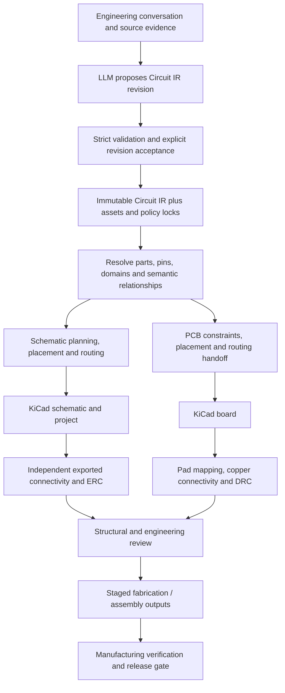

# Technical Architecture

Status: proposed implementation contract, 2026-09-19. No application is implemented by this design. Read this document first, then the [IR contract](CIRCUIT_IR_SPEC.md), the two layout specifications, and the [milestones](IMPLEMENTATION_PLAN.md). KiCad facts and sources are centralized in [KiCad integration](KICAD_INTEGRATION_SPEC.md); other algorithm choices below are proposals.

## 1. Product boundary

Build an electronic-design compiler with engineering evidence, beginning with readable schematics. The compiler accepts a reviewed, structured electrical design and produces inspectable presentation and physical artifacts. It does not establish that an arbitrary proposed circuit will function merely by compiling it.

There is deliberately no edge from schematic coordinates to PCB placement. Both branches share electrical identity and engineering relationships. A relationship such as decoupling has different schematic and physical interpretations.

The LLM can propose topology, parts, constraints, annotations and revisions. It cannot supply executable compiler extensions, final KiCad syntax, wire paths or routine placement coordinates. Mechanical requirements can contain real dimensions and externally specified connector positions. Deterministic search owns all remaining geometry. A visual model may annotate a render for review; its judgment never changes the compiler output or independently authorizes release.

## 2. Evidence that changes the design

| Inspected evidence | Observation | Architectural consequence |
|---|---|---|
| [Sallen-Key notes](../examples/good/sallen_key-bandpass-072/NOTES.md), source and rendered SVG | Two filter stages have recognizable local feedback paths, consistent signal flow and a separate power unit. Some ground symbols face upward for local clarity. | Use topology-specific relative constraints, package/unit identity, and contextual drafting rules; a universal ground-direction penalty would misclassify this reference. |
| [Class-D notes](../examples/good/Class-D/NOTES.md), source and rendered SVG | Control, paired drivers, switching devices and output filter form distinct regions. Repeated upper/lower structures make the power stage legible. | Preserve signal-path ordering and repeated-structure relations; not all crossing reduction is worth destroying circuit recognition. |
| [SensorProject notes](../examples/good/SensorProject_t16-pcb-main/NOTES.md), MCU SVG, root schematic and board source | Hierarchy, bus groups, local support networks and project libraries coexist; the board includes a stackup and physical interfaces. The MCU drawing also has dense areas. | References supply selected positive attributes, not blanket quality certification. Hierarchy, library resolution and PCB constraints need explicit contracts. |
| [Passive headphone regression](../examples/bad/legacy-headphone-amp-regression/README.md) | Label stubs hide three- and four-terminal structure; dummy resistors represent connectors. | Route local hyperedges as trees. This is a topology/routing fixture, not a realistic symbol-quality reference. |
| [NE5532 regression](../examples/bad/ne5532-headphone-amp-regressed/README.md) and SVG | Support parts collapse into a tall column; feedback, output and decoupling become hard to distinguish. | Affinity means meaningful relative placement, not equal x-coordinates. Include text, roles and composition in evaluation. |
| [NE5532 current baseline](../examples/baseline/ne5532-headphone-amp-current/README.md) | Its documented electrical failure was reproduced with KiCad 9.0.9: expected `VPLUS15` = `C1.1,C3.1,J3.1,U1.8`; exported membership = `C1.1`. Export exited zero with an annotation warning. | Actual exported connectivity is a hard gate. Exit status, metadata bindings and visual scores are insufficient. |
| [555 baseline](../examples/baseline/timer555-pwm-dimmer/README.md) | Timing node, CTRL bypass, gate series/pulldown and switched load carry different semantics. | Recognize and validate relationships before laying out a component graph. |

Positive simulation examples do not demonstrate manufacturing readiness. Existing fixture descriptions contain historical paths and expectations; the checked-in artifacts and fresh measurements take precedence. The NE5532 bad/current IRs contain 19/18 components respectively, so they cannot be treated as an electrically identical pair without an explicit migration. No files under `.local/` were inspected or used.

## 3. Core representations and ownership

Circuit IR owns intent and logical/electrical identity, plus separate schematic, PCB and manufacturing constraint sections. Derived representations own resolved assets and geometry. Derived files must never become a second source of net membership.

| Module, proposed under `src/ai_kicad/` | Inputs → outputs | Responsibility |
|---|---|---|
| `ir/` | JSON → `ValidatedDesign` or diagnostics | Strict schema, references, units, revision rules; no repair by deletion or guessing |
| `assets/` | Design + `assets.lock.json` → `ResolvedDesign` | Exact symbols, footprints, pin/pad maps, inherited graphics, geometry and evidence |
| `semantics/` | Resolved design → `SemanticPlan` | Verify authored relationships; recognize bounded motifs; explain ambiguities |
| `schematic/` | Resolved design + semantic plan + policy → `SchematicPlan`, then `SchematicLayout` | Hierarchy, presentation instances, placement, annotations, wires and labels |
| `pcb/` | Resolved design + mechanical/physical constraints → `BoardPlan`, `BoardLayout` | Placement, courtyards, access/return-path constraints, route request |
| `geometry/` | Integer shapes and transforms → intersections, distances, spatial queries | Shared geometry primitives, not shared schematic/PCB layouts |
| `kicad/` | Layouts → project artifacts; artifacts → independent observations | Version-specific AST codecs, netlist/report readers, CLI and narrow router bridge |
| `verify/` | Expected design + observed artifacts → `ValidationReport` | Electrical partitions, identity, mapped pads, semantic constraints and release gates |
| `evaluate/` | Artifacts + annotated fixture → `QualityReport` | Independent measurements, adversarial checks and review bundles |
| `build/`, `cli.py` | Explicit request → immutable artifact bundle | Ordered local execution, dependency hashes, diagnostics and atomic publication |

These are ordinary packages and typed function interfaces, not dynamically loaded plugins. Use Python 3.12, strict Pydantic 2 models at serialization boundaries, frozen internal records and pytest. Emit JSON Schema 2020-12 from the boundary models and test its agreement with this specification. Use Ruff and static type checking. Pin dependencies in a lockfile at implementation time.

OR-Tools CP-SAT is selected for discrete orientation/placement feasibility and local legalization. Its integer model fits finite orientation choices and separation constraints ([solver documentation](https://developers.google.com/optimization/cp/cp_solver)). Use custom semantic decomposition and deterministic orthogonal routing, not a monolithic solver over every wire coordinate. Native acceleration is postponed until profiling identifies a concrete hotspot.

## 4. Interface contract

Every stage is conceptually `run(input, context) -> StageResult[T]`. `context` contains only explicit immutable inputs: design digest, asset lock, toolchain lock, policy version, supported capabilities, seed and deterministic work budget. Filesystem/process access is confined to adapters.

`StageResult` contains `status` (`ok`, `invalid`, `unsupported`, `infeasible`, `budget_exhausted`, `tool_failed`), optional artifact, ordered diagnostics, and input/output digests. An `ok` placement is feasible under its declared checks; it does not imply optimality, routability or manufacturing readiness. Diagnostics contain `code`, `stage`, `severity`, `entity_ids`, `constraint_ids`, `json_pointer`, `message` and structured evidence. Unknown checks are `not_evaluated`, never a pass.

Principal derived contracts:

- `ResolvedDesign`: immutable terminal inventory and net partitions; resolved symbol variants and footprints; asset hashes; physical pin/pad mappings; normalized quantities; unresolved obligations.
- `SemanticPlan`: block tree, verified relationships, motif matches with terminal bindings, selected alternatives and recognition evidence. This stage cannot add nets or change parts.
- `SchematicLayout`: sheet instances, symbol-unit placements, port geometry, text envelopes, power/label nodes, bus member maps, and per-net route trees. Every object has stable identity and an IR origin.
- `BoardLayout`: outline/stackup, footprint poses, pad nets, keepouts, rule assignments and optional copper. It records which physical constraints have actually been verified.
- `ArtifactMap`: bijections from logical components/terminals to generated references, sheet instance paths, symbol pins and footprint pads; generated virtual objects are separately typed. It identifies observations but does not prove their connectivity.
- `BuildManifest`: complete dependency hashes, stage states, tools/options, artifacts, diagnostics and release readiness. Raw tool outputs accompany normalized reports.

An initial local CLI will expose `validate`, `build --target schematic|placement|manufacturing`, and `evaluate`. Proposed invocation: `python -m ai_kicad build design.json --target schematic --assets-lock assets.lock.json --toolchain-lock toolchain.lock.json --policy-lock policy.lock.json --out build/demo`. These commands do not exist yet. No implicit network fetch, user configuration, LLM call or missing-tool fallback occurs during a build.

## 5. Hard invariants

1. **Electrical partition preservation:** every real terminal has exactly one declared net or an explicit intentional-unconnected state. Compilation and layout cannot merge, split, drop or silently rename an externally required net. Geometry is absent from electrical fingerprints.
2. **Identity preservation:** stable component IDs, package terminals, part selections and pin/pad mappings survive symbol splitting, hierarchy, placement and export. A pin or gate swap is a separately accepted electrical revision, never a layout trick.
3. **Independent observation:** verify generated schematics against real KiCad-exported terminal partitions and explicit NC evidence; verify boards against expected pad assignments and post-fill copper/DRC. Hidden generator markers are never a correctness oracle.
4. **Constraint honesty:** every supported hard constraint is checked, with witness data. Unsupported mandatory capabilities stop the relevant target. A solver timeout is not proof of infeasibility. No automatic relaxation of hard constraints.
5. **Separation:** schematic distances never satisfy PCB proximity rules. Visual power symbols never count as physical supply components. BOM exclusions never silently remove an electrical terminal.
6. **Release honesty:** a schematic can be reviewable while PCB or manufacturing work is incomplete. Only the manufacturing gate can issue `release_ready`.
7. **No silent engineering repair:** ground names are not aliases by spelling. Missing assets do not become placeholder symbols. ERC failures do not trigger automatic PWR_FLAG insertion or blanket exclusions.

## 6. Reproducibility and revision control

The reproducibility unit is identical Circuit IR, resolved assets, policy, compiler and toolchain on the qualified Linux execution image/architecture. Do not promise identical optimization across different solver releases or CPUs without a cross-platform qualification.

Use integer nanometers for physical geometry and exact integer schematic grid ticks; use decimal electrical quantities. Sort unordered collections by stable ID, preserve intentional order, reject duplicate JSON keys and nonfinite numbers. UUIDv5 names derive from `design.id / artifact-kind / stable-object-id`; never use random UUIDs or wall time. The build key hashes all inputs, while stable object UUIDs do not depend on unrelated objects' content.

Search uses explicit seeds, stable ordering, one worker and operation/deterministic-time budgets. A wall-clock watchdog can abort with `tool_failed`; it cannot choose a different successful partial answer. External routing must independently pass repeatability qualification before joining the production deterministic path.

Canonical generated KiCad documents, normalized geometry and normalized reports must reproduce exactly. Keep raw exports with hashes, including tool timestamps where present; normalize only an enumerated set of nonsemantic metadata for comparisons. Copper, coordinates, net names, text and violations are never normalized away. Human/visual review is a separate signed observation over artifact hashes, not part of the pure compiler.

Accepted revisions have a parent digest and an explicit patch plus engineering rationale. Rebuild affected dependency stages and rerun relevant gates. Manual KiCad edits are imported as a separate candidate revision or explicit presentation/placement constraints; generation never silently overwrites or blesses them.

## 7. Decisions and rejected alternatives

| Decision | Rejected alternative and reason |
|---|---|
| Semantic motif constraints plus hierarchical optimization | Graphviz/DOT or force-directed placement as the schematic engine: neither supplies pin semantics, power conventions, readable feedback nor electrical routing guarantees. A graph view may remain a debugging aid. |
| Electrical hypergraph, separate presentation graph and board model | One components-and-nets graph with x/y hints cannot represent multi-unit packages, buses, intent, return paths and assembly requirements correctly. |
| Relative, parameterized drafting grammars | Copying corpus coordinates overfits symbols and values and fails on unfamiliar circuits. |
| Typed AST generation with KiCad as independent verifier | Regex editing, arbitrary string templates and treating AST validity as electrical validity. |
| Direct file generation plus CLI; narrow KiCad 10 DSN/SES bridge | GUI automation or IPC-only server operation: the version-specific headless boundary is documented in the integration spec. |
| Freerouting qualification before custom PCB autorouting | Building a complete board router early would consume the effort needed to establish placement and constraints. A router that fails repeatability remains outside release builds. |
| Feasibility gates, quality envelopes and human review | A single weighted score allows a fatal or embarrassing defect to be compensated by unrelated improvements. |

## 8. Scope and assumptions

Start with low-voltage, rigid, conventional boards and ordinary KiCad library symbols. High-voltage isolation, RF/antenna behavior, thermal performance and controlled impedance need explicit engineering inputs and separate verification capability; lack of that capability blocks the relevant release, not their representation in IR. Early scale targets are 5–50 components per schematic block, up to 200 components across sheets, and simple two-layer boards before dense/high-speed cases. These are qualification targets, not measured capacity.

The root license and legacy snapshot license differ; [reuse decisions](LEGACY_REUSE_DECISIONS.md) preserve that boundary. No code is copied into the future core by this task. Web interfaces, authentication, queues, hosting and production deployment remain postponed until the [core success gates](IMPLEMENTATION_PLAN.md) are demonstrated.
