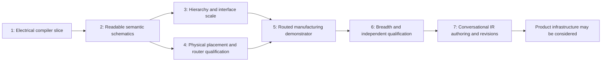

# Implementation Plan

Status: dependency-ordered delivery design, 2026-09-19. **This task stops at architecture; do not begin M1 here.** The milestones below produce evidence-backed vertical slices, not a list of every eventual feature. [Architecture](ARCHITECTURE.md) owns module boundaries and invariants; the other specifications own their detailed contracts.

## 1. Sequence and risk retirement



| Highest-risk hypothesis | Earliest experiment | Evidence that changes the plan |
|---|---|---|
| Real KiCad connectivity matches our semantic identity model | M1 complete-terminal export comparison and deliberate broken wires/NCs | If only metadata can establish equivalence, stop and correct the observation boundary |
| Semantic grammars generalize beyond familiar analog fixtures | M2 held-out topology, symbol-size and pinout substitutions with blind trace tasks | If recognizable feedback requires per-fixture coordinates, revisit grammar composition |
| Hierarchical scopes and multi-unit packages preserve identity | M2 unit tests; M3 repeated local names, buses and nested sheets | Any scope alias or omitted power unit blocks scale claims |
| Bounded optimization finds readable, routable arrangements predictably | M2 feasibility/budget reports; M3 dense sheets | If only unbounded tuning succeeds, revise decomposition before increasing corpus size |
| Placement cost predicts physical routing success | M4 equal-budget router probes and deliberately congested boards | Poor correlation requires a better access/congestion model, not more HPWL tuning |
| External routing can meet deterministic/headless and rule-preservation requirements | M4 small DSN/SES qualification before broad placement development | Nondeterministic copper or lost rules blocks release routing; isolate or replace the adapter |
| Exported manufacturing files represent the validated design | M5 CAM/assembly checks and a fabricated demonstrator | Wrong origin, population or physical behavior blocks manufacturing claims |

M4's router probe can start after M2 on tiny hand-placed qualification boards; it need not wait for a general placer. M3 and M4 are technically independent branches.

## 2. M1 — smallest complete electrical/compiler slice

**Entry:** accept the reviewed contracts and obtain the pinned KiCad 10.0.6 executable and the two standard symbol assets used by the divider. Record hashes, dependency versions, controlled configuration and command/report probes. The previously observed 9.0.9 installation does not qualify the target. No container build system, solver, general library index or full future schema is an entry prerequisite.

**Scope:** the exact divider JSON in [IR section 7](CIRCUIT_IR_SPEC.md#7-representative-complete-schematic-design) → deterministic layout → `.kicad_pro`/`.kicad_sch` → real KiCad netlist/ERC → independent equivalence → SVG. The only additional positive case replaces the connector with `Conn_01x04`, adds terminal 4 and an intentional NC with a reason/evidence, retaining the three connected nets. This cheaply distinguishes an omitted pin from a deliberately unused one. LED/polarity belongs to M2.

### M1a: prove the dangerous boundary first

Implement a small Python 3.12 package with strict input parsing, locked resolution of the requested resistor/connector assets, one envelope-derived divider layout, a minimal S-expression writer/reader, real CLI invocation and an independent observer/comparator. The input profile accepts only fields and discriminator values exercised by the divider/NC variants; later collections must be empty or null. Reject unknown fields, duplicate membership and unsupported features. Do not produce an all-capabilities schema with unimplemented validators.

One entry point suffices: `python -m ai_kicad build design.json --target schematic --assets-lock assets.lock.json --toolchain-lock toolchain.lock.json --policy-lock policy.lock.json --out build/demo`. Exit 0 means requested automated schematic gates passed; 2 invalid/unsupported, 3 infeasible/budget exhausted, 4 tool/internal failure. StageResult/diagnostic meanings remain those in architecture. Keep rejected output under a clearly failed staging/report directory; never publish it as accepted.

The initial implementation can use `ir.py`, `assets.py`, `schematic.py`, `kicad.py`, `verify.py`, `__main__.py` plus focused tests. These names are suggestions, not a scaffold mandate. Split files when responsibilities demand it. Use Pydantic 2 and frozen records where useful, pytest and Ruff; lock dependency versions. No legacy imports/source copying. Recognition is the divider relationship predicate, not a motif registry. Use exact nanometer geometry and a fixed envelope-based construction; no CP-SAT, beam, generic router or optimizer is necessary.

Keep these boundaries as ordinary functions, without a workflow framework:

```text
validate(raw_json, assets_lock, target) -> StageResult[ValidatedDesign]
resolve(validated, assets_lock) -> StageResult[ResolvedDesign]
layout_schematic(resolved, context) -> StageResult[SchematicLayout]
emit_schematic(layout, resolved, context) -> StageResult[ProjectArtifacts]
observe_electrical(project, toolchain) -> StageResult[ObservedElectricalGraph]
verify_electrical(expected, observed, actual_nc_evidence) -> ValidationReport
```

The observer receives actual files and tools, not a scene graph or intended net membership. It inventories actual symbol instances/embedded pins and consumes KiCad XML for observed net assignments. The comparator alone receives expected IR and an independently checked identity mapping. Pin maps must agree with asset/package numbers; metadata markers and labels alone cannot establish equivalence.

**M1a exit:** the exact 3-component, 7-terminal, 3-net divider exports/renders successfully. A generated artifact with one detached branch fails comparison despite unchanged IR and generator metadata. This checkpoint must precede building richer provenance/schema infrastructure. It proves observation, not yet complete M1 qualification.

### M1b: qualify the same narrow slice

Add the NC variant (3 components, 8 terminals, 3 connected nets, 1 NC), strict profile schema generation, minimal lock/manifest serialization and the following evidence. No additional circuit family is needed.

- Positive projects have zero unexpected ERC findings/annotation warnings; their symbol/reference inventories, values, terminal partitions and required names match. All pins are independently accounted for even if XML omits NC or isolated pins. A KiCad-exported omission must not be filled from intended membership.
- Artifact mutations preserve expected IR while removing a branch, moving a wire off-pin, inserting an unwanted junction, changing an actual pin number/map, deleting the NC marker, connecting the NC terminal, or removing a symbol. Each must fail the relevant observer/check. Include a stale/missing/empty CLI report and show it cannot pass.
- Input mutations catch duplicate membership, unknown assets, wrong pin maps and unsupported capability fields. Permuting set-like arrays preserves output; changing a real connection changes the fingerprint.
- Three clean builds across two directories reproduce compiler-owned files, observed partitions and normalized SVG geometry/text. Record precise executable/library/config/dependency hashes and CPU/platform facts. A fixed local environment is sufficient for M1; reproducible container packaging and five-run solver/router qualification begin when those dependencies enter the path.
- A single engineering reviewer can trace the divider and locate the intentionally unused connector pin in the actual render. Required values/pin numbers are legible, no crossings/collisions exist, and no hidden label-only wiring substitutes for the local branch. M1 does not require a blinded two-reviewer corpus study.

Use explicit wires/local labels for M1's supply/reference nets. Global scope permits this; no power symbols/PWR_FLAG are necessary for passive connectors/resistors. Do not qualify hidden power behavior merely by loading unused power assets. The historical NE5532 observer regression is deferred to the M2 multi-unit adapter gate; the M1 detached-branch mutation proves the same core failure class without importing the legacy IR.

**Exit/demonstrate before M2:** one command builds either positive fixture in the recorded environment and the mutation suite fails for the expected reasons. Publish actual KiCad outputs, independent comparison, ERC, SVG, input/assets/tool/policy hashes and check states. Derived intermediate JSON is optional diagnostic output; a cache, reusable task graph, comprehensive public editing API and full future schema are not required.

**Ordinary Codex/Sol:** implement M1a then M1b in reviewable changes. Another Astra review is warranted only if real exports cannot distinguish identities/NC states under this narrow profile; do not paper over that failure by trusting intent metadata.

## 3. M2 — semantic analog and support-network layout

**Entry:** M1 gates pass without hand-editing generated files. A versioned tuning/holdout protocol is frozen.

**Slice:** add LED/polarity and RC slices, then op-amp buffers/amplifiers, Sallen-Key, linear regulators, split references, decoupling, timer and switching-control motifs; multi-unit package identity; compositional motif constraints and multi-terminal routing, introducing CP-SAT only after constructive placement exposes a concrete need. Start with a buffer and its feedback/decoupling, then compose two unlike stages. Include unfamiliar symbol sizes, long labels and deliberate unsupported cases.

**Early identity checkpoint:** before general optimization, qualify a dual op-amp with separate power unit, a missing-power-unit mutation, split rails/local reference, and stacked/hidden-pin behavior (or explicit unsupported rejection). Add the historical NE5532 negative observation without porting its legacy generator.

**Exit:** at least 12 reviewed tuning designs and 8 held-out designs spanning the qualified families; 100% electrical/legality gates; at least 90% valid held-out outputs meet the blinded review rubric in [evaluation](EVALUATION_PLAN.md). Every known severe regression remains rejected. No label-only replacement of local motifs, no pin swaps and no special-case reference names. Five reruns reproduce every accepted output; bounded failures explain their constraints.

**Demonstrate before proceeding:** a renamed/reordered NE5532-inspired design and an unseen two-stage analog composition remain recognizable with exact connectivity. The comparison uses one reviewed IR per circuit, not the differing historical bad/current IRs.

**Ordinary Codex/Sol:** motif predicates, variant constraints, routing and measurements with focused fixtures. **Astra review is justified** if held-out readability stalls despite legal local motifs, recognition conflicts require a new compositional model, or solver budgets make the chosen decomposition untenable. Do not call for architecture review merely to add another conventional motif.

## 4. M3 — hierarchy, buses and realistic schematic scale

**Entry:** M2 demonstrates readable single-sheet circuits and complete multi-unit identity.

**Slice:** MCU minimum system with power/reset/crystal, I2C/SPI/UART interfaces, repeated sensor channels and explicit sheet ports. Add automatic block-based partitioning, vector/named buses, repeated-channel correspondence and qualified hierarchy import/observation. Use separate expanded child files initially; shared reusable sheet-file instances are separately tested before support.

**Exit:** at least 10 realistic new cases, including 4 held-out compositions; one 100–200-component multi-sheet design is qualified with declared runtime/memory. Every scalar bus member and repeated sheet identity round-trips; identical local names in separate scopes stay separate. Blind reviewers can trace interface paths without global-label sprawl. All target designs meet hard gates and the same 90% held-out readability criterion.

**Demonstrate before proceeding:** a SensorProject-inspired hierarchy using independently authored Circuit IR, plus renamed repeated channels and an added channel, preserves topology and readable organization. This is not coordinate reconstruction of the original project.

**Ordinary Codex/Sol:** port mapping, scope tests, hierarchy assembly, bus routing and renderer/reporting. **Astra review:** only if the representation of scopes, repeated instances or partition objectives must change across modules.

## 5. M4 — constrained PCB placement and router boundary

**Entry:** M2 correctness and semantic identity are stable; locked footprint/pad assets and at least three small mechanically specified board cases exist. M3 is not required to probe routing interoperability.

**Slice:** place fixed connectors/holes, free passives and critical local groups on small two-layer boards. First qualify the headless KiCad DSN/SES bridge and Freerouting repeatability on a tiny board with known clearances/keepouts, independently of placer quality. Then add discrete cluster placement, exact legalization and congestion feedback.

**Exit:** at least 6 placement cases covering decoupling, crystal proximity, switching-loop intent, connector access, cutouts and an infeasible fixed-part case. No fixed-part drift or net/pad-map change. Congestion predictions are compared with actual equal-budget routing on at least 4 supported low-speed boards. Five clean router reruns produce identical normalized copper; rule projection and post-import invariants pass. Unsupported differential/RF/thermal obligations fail explicitly rather than passing under generic rules.

**Demonstrate before proceeding:** changing a board outline or connector constraint changes physical placement independently of schematic geometry. An intentionally impossible connector/keepout combination returns useful constraint evidence. If external routing cannot meet deterministic/rule-preservation requirements, this milestone remains incomplete for the routing path; caching output is not a substitute.

**Ordinary Codex/Sol:** footprint mapping, mechanical checks, adapter isolation, route diffs and local optimization. **Astra review:** router determinism failure requiring a replacement, poor congestion/routability correlation, or incompatible critical-cluster constraints. Do not start a general autorouter to avoid that review.

## 6. M5 — routed manufacturing demonstrator

**Entry:** M3 schematic and M4 physical/router gates pass for the demonstrator's explicit capability envelope. An approved stackup/process/assembly profile and reviewed part selections are available.

**Slice:** one useful low-voltage circuit with connectors, regulator/support, mixed component sizes and test points goes from IR through schematic, placement, external routing, zone fill and independent verification to Gerbers, drills, BOM and positions. A simple sensor/interface board is preferable to a dense high-speed challenge. Additional bottom-side, through-hole and slot fixtures qualify those export transformations even if absent from the demonstrator.

**Exit:** complete connectivity; no unexpected ERC/DRC; all mandatory constraints evaluated; deterministic filled board and exports; independent CAM, BOM and placement reconciliation. A fabricated/assembled sample passes documented power-up and functional measurements against design requirements. Until hardware evidence exists, report only “export-qualified,” not “manufacturing-proven.”

**Demonstrate before proceeding:** the released files, actual board and measured behavior refer to the same design/toolchain/variant hashes. DNP and alternate part handling cannot silently change the electrically required circuit.

**Ordinary Codex/Sol:** output adapters, manifest/rule coverage, CAM parsing, variant reconciliation and regression tests. Hardware review/measurements require engineering evidence. **Astra review:** cross-domain failures that require changes to the IR or release model; ordinary export defects remain normal implementation work.

## 7. M6 — breadth and independent qualification

**Entry:** the demonstrator has passed M5. Freeze a broader protocol before tuning further.

**Slice:** cover all families in the evaluation matrix, including connector-heavy and mixed-signal compositions, buses, repeated channels, split supplies, virtual references and sensitive differential/clock cases. Classify each requested capability as qualified or explicitly unsupported. Sensitive routing requires real rule/analysis support before joining the qualified envelope.

**Exit:** at least 20 independent held-out designs for the claimed schematic envelope, with family-level reporting and at least 90% blinded acceptance; 100% electrical/legality gates on accepted results; zero known severe regressions. At least 6 held-out supported board cases pass mechanical/routing/manufacturing checks. Publish runtime/memory, failure diagnostics, reproducibility and capability exclusions. A family cannot be advertised as supported solely because it parses or is gracefully rejected.

**Demonstrate before proceeding:** a reviewer unfamiliar with the generator can explain its failures, reproduce accepted outputs and verify the stated limits. Only now may web/UI/product infrastructure be considered; adding it is a separate task.

**Ordinary Codex/Sol:** corpus expansion, bounded algorithm improvements and qualification automation. **Astra review:** an independent architecture/quality review of generalization, advanced routing needs and whether evidence supports expansion of the product boundary. It should review actual artifacts and failures, not repeat the initial design exercise.

## 8. M7 — conversational engineering and accepted IR revisions

**Entry:** M6's deterministic core is qualified for an explicit capability envelope. This is the eventual LLM product capability, not generic hosted infrastructure.

**Slice:** a local conversational client gathers requirements, retrieves attributed component evidence and proposes initial IR or revisions through the `RevisionProposal` boundary in architecture. It shows unresolved requirements and semantic diffs, accepts a revision explicitly, invokes the deterministic compiler and explains diagnostics without editing generated files. Model selection is an implementation-time decision. No authentication, queues or web service is necessary.

**Exit:** representative creation and revision conversations cover changed supply voltage, component substitution, added repeated channel and a conflicting mechanical requirement. Accepted snapshots replay deterministically without the LLM; stale patches, unsupported constraints, invented parts/pins and attempts to change hard constraints without acceptance are rejected. Conversation/evidence provenance survives revisions, and the user can distinguish suggested from accepted and verified designs. Revisions preserve stable identity and rerun affected gates.

**Ordinary Codex/Sol:** local client, validated patch transaction, semantic diff and replay fixtures. **Astra review:** only if realistic conversations expose an IR capability gap or revision/evidence ownership ambiguity. Product infrastructure is a separate later decision after this authoring loop demonstrates value; it is not a prerequisite for the EDA core or M7.
