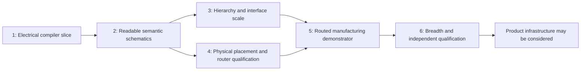

# Implementation Plan

Status: dependency-ordered delivery design, 2026-09-19. **This task stops at architecture; do not begin M1 here.** The milestones below produce evidence-backed vertical slices, not a list of every eventual feature. [Architecture](ARCHITECTURE.md) owns module boundaries and invariants; the other specifications own their detailed contracts.

## 1. Sequence and risk retirement



| Highest-risk hypothesis | Earliest experiment | Evidence that changes the plan |
|---|---|---|
| Real KiCad connectivity matches our semantic identity model | M1 complete-terminal export comparison and deliberate broken wires/NCs | If only metadata can establish equivalence, stop and correct the observation boundary |
| Semantic grammars generalize beyond familiar analog fixtures | M2 held-out topology, symbol-size and pinout substitutions with blind trace tasks | If recognizable feedback requires per-fixture coordinates, revisit grammar composition |
| Hierarchical scopes and multi-unit packages preserve identity | M2 unit tests; M3 repeated local names, buses and nested sheets | Any scope alias or omitted power unit blocks scale claims |
| Bounded optimization finds readable, routable arrangements predictably | M2 feasibility/budget reports; M3 dense sheets | If only unbounded tuning succeeds, revise decomposition before increasing corpus size |
| Placement cost predicts physical routing success | M4 equal-budget router probes and deliberately congested boards | Poor correlation requires a better access/congestion model, not more HPWL tuning |
| External routing can meet deterministic/headless and rule-preservation requirements | M4 small DSN/SES qualification before broad placement development | Nondeterministic copper or lost rules blocks release routing; isolate or replace the adapter |
| Exported manufacturing files represent the validated design | M5 CAM/assembly checks and a fabricated demonstrator | Wrong origin, population or physical behavior blocks manufacturing claims |

M4's router probe can start after M2 on tiny hand-placed qualification boards; it need not wait for a general placer. M3 and M4 are technically independent branches.

## 2. M1 — smallest complete electrical/compiler slice

**Entry:** these documents are accepted as the implementation contract. Obtain the pinned KiCad 10.0.6 toolchain and standard library snapshots specified in [integration](KICAD_INTEGRATION_SPEC.md); capture hashes and command/report-schema probes. Local KiCad 9.0.9 can investigate historical fixtures but cannot satisfy this gate. No architecture choice remains contingent on adopting the old IR or document model.

**Slice:** the complete voltage-divider JSON in [IR section 7](CIRCUIT_IR_SPEC.md#7-representative-complete-schematic-design), plus one LED/resistor/two-pin supply-connector design, become ordinary `.kicad_pro`/`.kicad_sch` projects with renders, exact observed connectivity, ERC and a reproducibility manifest. No PCB, optimizer framework, general importer or LLM integration is needed.

Proposed initial files (create during M1, not now):

```text
pyproject.toml, dependency lock, schemas/circuit-ir-0.1.0.schema.json
src/ai_kicad/ir/{models,validate,canonical}.py
src/ai_kicad/assets/{lock,resolve,symbols}.py
src/ai_kicad/semantics/motifs.py
src/ai_kicad/schematic/{model,basic_layout,route}.py
src/ai_kicad/kicad/{sexpr,schematic,project,cli,netlist}.py
src/ai_kicad/verify/{electrical,reports}.py
src/ai_kicad/build/{context,manifest}.py
src/ai_kicad/{__init__,__main__}.py
tests/{unit,integration}/, tests/fixtures/{divider,led}/
```

Use Python 3.12, Pydantic 2 strict boundary models, immutable domain records, pytest and Ruff. Lock actual dependency versions. There is no runtime import from `research/legacy_openclaw/`; preserve the license boundary described in [reuse decisions](LEGACY_REUSE_DECISIONS.md). The legacy snapshot's old application metadata and entry points are not the new package.

Implement `validate` and `build --target schematic` with the proposed flags from architecture. `validate` performs schema/semantic/asset checks; `build` also lays out, generates, invokes KiCad and verifies. Exit 0 means the requested target's mandatory automated gates pass; exit 2 is invalid/unsupported input, 3 is infeasible/budget-exhausted generation, and 4 is tool/internal failure. Human quality and manufacturing readiness are separate manifest fields and cannot be implied by exit 0. Diagnostics go to `reports/`, including on failure; never publish failed output as an accepted project.

Boundary functions, using the names defined in architecture:

```text
validate(raw_json, assets_lock, target) -> StageResult[ValidatedDesign]
resolve(validated, assets_lock) -> StageResult[ResolvedDesign]
recognize(resolved, policy) -> StageResult[SemanticPlan]
layout_schematic(resolved, semantic, context) -> StageResult[SchematicLayout]
emit_schematic(layout, resolved, context) -> StageResult[ProjectArtifacts]
observe_electrical(project, toolchain) -> StageResult[ObservedElectricalGraph]
verify_electrical(expected, observed, actual_nc_evidence) -> ValidationReport
```

Only the two narrow motif grammars and supported `sch.keep_motif` constraints are executable in M1. Derive positions from resolved envelopes and the `drafting.v1` rules; emit connected trees with exact endpoints and junctions. Reject unsupported features, instead of dropping fields to force them through the slice. Representing future PCB fields is allowed; their verification status remains `not_evaluated` for this target.

**Exit evidence:**

- Divider contains exactly 3 physical components, 7 terminals and 3 nets. LED slice contains exactly 3 physical components, 6 terminals and 3 nets. Standard virtual power/flag symbols are counted separately and validated against accepted source assertions.
- Real KiCad exports match the complete intended partitions, required names/scope, component identities and NC test fixtures. No annotation warning or unexpected ERC finding is ignored. The NE5532 current baseline remains rejected by the independent observer.
- Mutation tests catch omitted branches, off-pin wires, unwanted junctions/shorts, wrong pin mappings, duplicate membership and connected NC pins. Input permutation preserves canonical output; altered connectivity changes the electrical fingerprint.
- Exact generated bytes and normalized reports reproduce across five clean runs in two different work directories. Missing assets/tools, extra JSON keys and unsupported constraints produce explicit failures.
- Clean KiCad SVGs visibly show the series/divider structure, legible fields and no crossings/collisions. A brief engineering review approves only this tiny supported scope.

**Demonstrate before proceeding:** one command produces both accepted bundles in a clean qualified environment, and one intentionally broken candidate fails for the expected reason. This proves the vertical boundary; it is not a claim of general schematic generation.

**Ordinary Codex/Sol work:** package/schema construction, integer geometry primitives, exact library resolution, deterministic serialization, CLI adapter and mutation tests, implemented in reviewable slices. The specification above is sufficient to start without another architecture session.

## 3. M2 — semantic analog and support-network layout

**Entry:** M1 gates pass without hand-editing generated files. A versioned tuning/holdout protocol is frozen.

**Slice:** add op-amp buffers/amplifiers, Sallen-Key, linear regulators, split references, decoupling, timer and switching-control motifs; multi-unit package identity; CP-SAT motif/block placement and multi-terminal routing. Start with a buffer and its feedback/decoupling, then compose two unlike stages. Include unfamiliar symbol sizes, long labels and deliberate unsupported cases.

**Exit:** at least 12 reviewed tuning designs and 8 held-out designs spanning the qualified families; 100% electrical/legality gates; at least 90% valid held-out outputs meet the blinded review rubric in [evaluation](EVALUATION_PLAN.md). Every known severe regression remains rejected. No label-only replacement of local motifs, no pin swaps and no special-case reference names. Five reruns reproduce every accepted output; bounded failures explain their constraints.

**Demonstrate before proceeding:** a renamed/reordered NE5532-inspired design and an unseen two-stage analog composition remain recognizable with exact connectivity. The comparison uses one reviewed IR per circuit, not the differing historical bad/current IRs.

**Ordinary Codex/Sol:** motif predicates, variant constraints, routing and measurements with focused fixtures. **Astra review is justified** if held-out readability stalls despite legal local motifs, recognition conflicts require a new compositional model, or solver budgets make the chosen decomposition untenable. Do not call for architecture review merely to add another conventional motif.

## 4. M3 — hierarchy, buses and realistic schematic scale

**Entry:** M2 demonstrates readable single-sheet circuits and complete multi-unit identity.

**Slice:** MCU minimum system with power/reset/crystal, I2C/SPI/UART interfaces, repeated sensor channels and explicit sheet ports. Add automatic block-based partitioning, vector/named buses, repeated-channel correspondence and qualified hierarchy import/observation. Use separate expanded child files initially; shared reusable sheet-file instances are separately tested before support.

**Exit:** at least 10 realistic new cases, including 4 held-out compositions; one 100–200-component multi-sheet design is qualified with declared runtime/memory. Every scalar bus member and repeated sheet identity round-trips; identical local names in separate scopes stay separate. Blind reviewers can trace interface paths without global-label sprawl. All target designs meet hard gates and the same 90% held-out readability criterion.

**Demonstrate before proceeding:** a SensorProject-inspired hierarchy using independently authored Circuit IR, plus renamed repeated channels and an added channel, preserves topology and readable organization. This is not coordinate reconstruction of the original project.

**Ordinary Codex/Sol:** port mapping, scope tests, hierarchy assembly, bus routing and renderer/reporting. **Astra review:** only if the representation of scopes, repeated instances or partition objectives must change across modules.

## 5. M4 — constrained PCB placement and router boundary

**Entry:** M2 correctness and semantic identity are stable; locked footprint/pad assets and at least three small mechanically specified board cases exist. M3 is not required to probe routing interoperability.

**Slice:** place fixed connectors/holes, free passives and critical local groups on small two-layer boards. First qualify the headless KiCad DSN/SES bridge and Freerouting repeatability on a tiny board with known clearances/keepouts, independently of placer quality. Then add discrete cluster placement, exact legalization and congestion feedback.

**Exit:** at least 6 placement cases covering decoupling, crystal proximity, switching-loop intent, connector access, cutouts and an infeasible fixed-part case. No fixed-part drift or net/pad-map change. Congestion predictions are compared with actual equal-budget routing on at least 4 supported low-speed boards. Five clean router reruns produce identical normalized copper; rule projection and post-import invariants pass. Unsupported differential/RF/thermal obligations fail explicitly rather than passing under generic rules.

**Demonstrate before proceeding:** changing a board outline or connector constraint changes physical placement independently of schematic geometry. An intentionally impossible connector/keepout combination returns useful constraint evidence. If external routing cannot meet deterministic/rule-preservation requirements, this milestone remains incomplete for the routing path; caching output is not a substitute.

**Ordinary Codex/Sol:** footprint mapping, mechanical checks, adapter isolation, route diffs and local optimization. **Astra review:** router determinism failure requiring a replacement, poor congestion/routability correlation, or incompatible critical-cluster constraints. Do not start a general autorouter to avoid that review.

## 6. M5 — routed manufacturing demonstrator

**Entry:** M3 schematic and M4 physical/router gates pass for the demonstrator's explicit capability envelope. An approved stackup/process/assembly profile and reviewed part selections are available.

**Slice:** one useful low-voltage circuit with connectors, regulator/support, mixed component sizes and test points goes from IR through schematic, placement, external routing, zone fill and independent verification to Gerbers, drills, BOM and positions. A simple sensor/interface board is preferable to a dense high-speed challenge. Additional bottom-side, through-hole and slot fixtures qualify those export transformations even if absent from the demonstrator.

**Exit:** complete connectivity; no unexpected ERC/DRC; all mandatory constraints evaluated; deterministic filled board and exports; independent CAM, BOM and placement reconciliation. A fabricated/assembled sample passes documented power-up and functional measurements against design requirements. Until hardware evidence exists, report only “export-qualified,” not “manufacturing-proven.”

**Demonstrate before proceeding:** the released files, actual board and measured behavior refer to the same design/toolchain/variant hashes. DNP and alternate part handling cannot silently change the electrically required circuit.

**Ordinary Codex/Sol:** output adapters, manifest/rule coverage, CAM parsing, variant reconciliation and regression tests. Hardware review/measurements require engineering evidence. **Astra review:** cross-domain failures that require changes to the IR or release model; ordinary export defects remain normal implementation work.

## 7. M6 — breadth and independent qualification

**Entry:** the demonstrator has passed M5. Freeze a broader protocol before tuning further.

**Slice:** cover all families in the evaluation matrix, including connector-heavy and mixed-signal compositions, buses, repeated channels, split supplies, virtual references and sensitive differential/clock cases. Classify each requested capability as qualified or explicitly unsupported. Sensitive routing requires real rule/analysis support before joining the qualified envelope.

**Exit:** at least 20 independent held-out designs for the claimed schematic envelope, with family-level reporting and at least 90% blinded acceptance; 100% electrical/legality gates on accepted results; zero known severe regressions. At least 6 held-out supported board cases pass mechanical/routing/manufacturing checks. Publish runtime/memory, failure diagnostics, reproducibility and capability exclusions. A family cannot be advertised as supported solely because it parses or is gracefully rejected.

**Demonstrate before proceeding:** a reviewer unfamiliar with the generator can explain its failures, reproduce accepted outputs and verify the stated limits. Only now may web/UI/product infrastructure be considered; adding it is a separate task.

**Ordinary Codex/Sol:** corpus expansion, bounded algorithm improvements and qualification automation. **Astra review:** an independent architecture/quality review of generalization, advanced routing needs and whether evidence supports expansion of the product boundary. It should review actual artifacts and failures, not repeat the initial design exercise.
